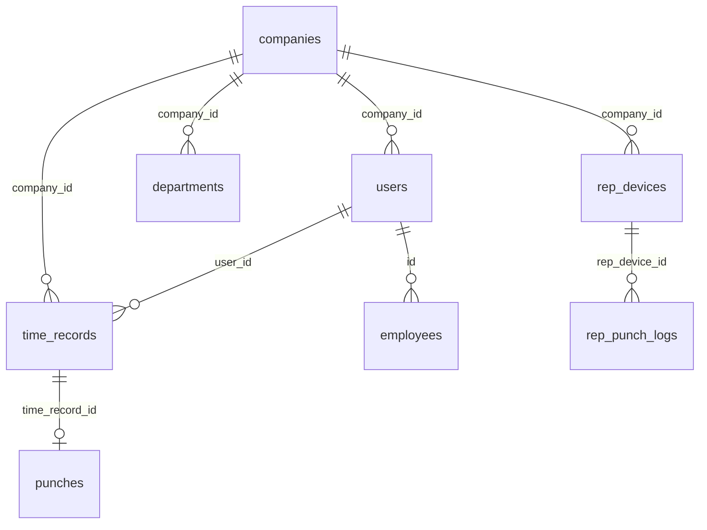

# Base de dados (Supabase / PostgreSQL)

Para contexto de produto e papéis, ver primeiro **`docs/overview.md`**. Este ficheiro aprofunda **tabelas e relações**.

A fonte de verdade do esquema aplicado em produção é o histórico em **`supabase/migrations/`** (executar em ordem no projeto Supabase). Os ficheiros `supabase_full_schema.sql` / `supabase_schema.sql` na raiz podem estar desatualizados relativamente às migrações; use-os apenas como referência rápida.

**Autenticação:** `auth.users` (gerido pelo Supabase Auth). `public.users.id` referencia tipicamente `auth.users(id)`.

**Armazenamento de ficheiros:** bucket `photos` (fotos de ponto, etc.), definido nas migrações / `supabase_full_schema.sql`.

---

## Diagrama lógico (multi-tenant)

---

## Tabelas por domínio

### Núcleo e multi-empresa

| Tabela | Propósito |
|--------|-----------|
| **users** | Perfil da aplicação: nome, email, cargo, `role`, `company_id`, preferências, cadastro trabalhista, etc. |
| **companies** | Tenant: nome, CNPJ, endereço, `settings`, geofence, **plan** (free/pro/enterprise), regras. |
| **departments** | Departamentos / setores por empresa. |
| **job_titles** | Cargos. |
| **employees** | Legado / cadastro estendido de colaboradores (convive com `users`). |
| **employee_invites** | Convites por token (onboarding por link). |
| **global_settings** | Parâmetros globais da app. |
| **company_rules** | Regras por empresa (compat / motor). |
| **tenant_audit_log** | Auditoria por tenant. |

### Ponto e batidas

| Tabela | Propósito |
|--------|-----------|
| **time_records** | Batidas principais: tipo, método, localização, foto, justificação, antifraude, ajustes. |
| **punches** | Marcações alternativas / normalizadas (ligação ao espelho). |
| **time_record_change_log** | Histórico de alterações em registos de ponto. |
| **time_balance** | Saldos de horas por utilizador/ período. |
| **time_adjustments** | Pedidos / ajustes de tratamento de ponto. |
| **time_adjustments_history** | Histórico do fluxo de ajustes. |
| **timesheets** | Folhas de ponto / consolidações (módulo tratamento). |
| **timesheets_daily** | Cálculos diários (pré-folha / motor). |
| **payroll_summaries** | Resumos por período (pré-folha). |
| **bank_hours** | Banco de horas. |
| **overtime_rules** | Regras de horas extras. |
| **requests** | Pedidos (férias, abono, etc.) com vínculo a turnos quando aplicável. |
| **notifications** | Notificações in-app. |

### Jornada, escalas e calendário

| Tabela | Propósito |
|--------|-----------|
| **work_shifts** | Definição de jornadas / turnos. |
| **schedules** | Escalas nomeadas. |
| **escala_ciclica** / **escala_mensal** | Escalas cíclicas e mensais. |
| **escala_dias** | Dias da escala detalhada. |
| **colaborador_jornada** | Atribuição colaborador × jornada. |
| **employee_shift_schedule** | Ligação funcionário × escala × datas. |
| **employee_absences** | Faltas / ausências (espelho). |
| **holidays** | Feriados (módulo folga/falta). |
| **feriados** | Cadastro de feriados por empresa. |
| **feriado_departamentos** | Feriado aplicável a departamentos. |
| **feriado_cidades** | Feriado aplicável a cidades. |
| **lancamento_eventos** | Lançamentos para folha / eventos. |

### Cartão de ponto e relatórios locais

| Tabela | Propósito |
|--------|-----------|
| **justificativas** | Tipos de justificação. |
| **cartao_ponto_dia** | Dia consolidado no cartão. |
| **ajustes_parciais** | Ajustes parciais no cartão. |
| **registro_funcoes** | Registo de funções. |
| **sobre_aviso** / **horas_espera** | Sobreaviso e horas de espera. |
| **colunas_mix** | Configuração de colunas do mix de relatório. |
| **arquivamento_calculos** | Arquivo de cálculos. |

### Motor e inconsistências

| Tabela | Propósito |
|--------|-----------|
| **time_inconsistencies** | Inconsistências detectadas. |
| **night_hours** | Horas noturnas. |
| **time_alerts** | Alertas de tempo. |

### Cadastros gerais (RH)

| Tabela | Propósito |
|--------|-----------|
| **estruturas** / **estrutura_responsaveis** | Estrutura organizacional. |
| **cidades** / **estados_civis** | Cadastros auxiliares. |
| **eventos_folha** | Eventos para folha. |
| **motivo_demissao** | Motivos de desligamento. |

### REP / relógios / integração

| Tabela | Propósito |
|--------|-----------|
| **rep_devices** | Registradores REP na rede. |
| **rep_punch_logs** | Batidas brutas / fila antes de promover para `time_records`. |
| **rep_logs** | Logs de operação do REP. |
| **time_nsr_sequence** | Sequência NSR (Portaria). |
| **point_receipts** | Comprovantes / recibos de ponto. |
| **timeclock_devices** | Espelho hub / relógios para TimeClock. |
| **devices** | Dispositivos (adaptador). |
| **clock_event_logs** / **clock_sync_logs** | Eventos e sincronização do relógio. |
| **punch_interpretations** / **punch_risk_analysis** | Interpretação enterprise de batidas. |

### Antifraude e evidências

| Tabela | Propósito |
|--------|-----------|
| **work_locations** | Locais de trabalho confiáveis. |
| **trusted_devices** | Dispositivos confiáveis. |
| **employee_biometrics** | Referência biométrica. |
| **punch_evidence** | Evidências de marcação. |
| **fraud_alerts** | Alertas de fraude. |

### Folha de pagamento (módulo)

| Tabela | Propósito |
|--------|-----------|
| **folha_pagamento_periodos** | Períodos de folha. |
| **folha_pagamento_itens** | Itens por colaborador / período. |

### Segurança, LGPD e auditoria

| Tabela | Propósito |
|--------|-----------|
| **audit_logs** | Logs de auditoria da aplicação (ações, IP, etc.). |
| **audit_log** | Trilha LGPD / segurança reforçada. |
| **user_consents** | Consentimentos. |
| **dpo_info** | Informação do encarregado de dados. |
| **data_portability_requests** / **data_deletion_requests** | Pedidos RGPD. |
| **device_keys** | Chaves de dispositivo. |
| **login_attempts** | Tentativas de login. |

### Importação e sistema

| Tabela | Propósito |
|--------|-----------|
| **employee_import_logs** / **employee_import_errors** | Importação em lote de colaboradores. |
| **system_settings** | Configurações do sistema. |
| **user_settings** | Preferências por utilizador. |
| **company_locations** | Localizações da empresa (geofencing). |

---

## Relações frequentes

- **`users.company_id` → `companies.id`** — isolamento por empresa (multi-tenant).
- **`time_records.user_id` / `company_id`** — batida de um utilizador numa empresa.
- **`rep_punch_logs.rep_device_id` → `rep_devices.id`**; **`rep_punch_logs.company_id`** — fila REP por dispositivo.
- **`departments.company_id`**, **`feriados.company_id`**, etc. — a maioria das tabelas de cadastro repete `company_id` para RLS.

Para colunas exatas e tipos, abra a migração que cria a tabela ou use o **Schema Visualizer** no Supabase após aplicar migrações.
