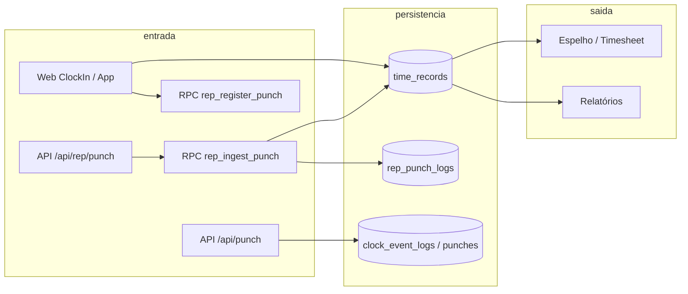

# Validação do fluxo de ponto (BATIDA → BANCO → RELATÓRIO)

Contexto geral do sistema: **`docs/overview.md`**.

Documentação baseada no **código e migrações** do repositório. Não substitui testes E2E nem auditoria de políticas RLS no Supabase.

---

## Visão geral do fluxo

---

## 1. Duplicidade — mesma batida não gravada duas vezes

### O que está implementado

| Caminho | Mecanismo | Onde |
|---------|-----------|------|
| **REP / AFD / sync** | RPC `rep_ingest_punch` devolve `duplicate` quando o NSR já existe para o contexto (mensagem tratada como «já importado»). O serviço `ingestPunch` em `modules/rep-integration/repService.ts` propaga `duplicate` e os lotes (`ingestAfdRecords`, `ingestPunchesFromDevice`) incrementam `duplicated` em vez de duplicar linha. |
| **Agente `/api/punch` (lote)** | `api/punch.ts`: **upsert** com `onConflict: 'dedupe_hash'` e `ignoreDuplicates: true` — chave lógica de deduplicação na tabela configurável (`clock_event_logs` por omissão). |
| **Espelho / consolidação** | `findTimeRecordIdByCompanySourceNsr` em `services/timeRecords.service.ts` — localiza batida já gravada por `company_id` + `source=rep` + `nsr` (uso em fluxos de UI que evitam reprocessar o mesmo NSR). |
| **Portaria / web seguro** | `rep_register_punch` / `rep_register_punch_secure` (migrações em `supabase/migrations`): cadeia **NSR + hash** por empresa, comprovando encadeamento; não é o mesmo critério que «dedupe_hash» do agente, mas reforça integridade REP-P. |

### Lacunas / atenção

- **`createTimeRecord`** (`services/timeRecords.service.ts`): insert direto em `time_records` **sem** dedupe no serviço — quem chama deve garantir unicidade ou depender de **constraints** no Postgres (se existirem no projeto remoto).
- **`insert_time_record_for_user`** (RPC admin): valida empresa e papel; a documentação em migração não descreve dedupe por batida dupla — risco residual se o mesmo evento for submetido duas vezes por caminhos diferentes.

**Conclusão:** duplicidade **bem coberta** nos fluxos REP ingest e agente com `dedupe_hash`; **não garantida globalmente** para qualquer insert arbitrário em `time_records`.

---

## 2. Ordem — saída sem entrada, intervalo inválido

### O que está implementado

| Caminho | Mecanismo | Onde |
|---------|-----------|------|
| **Web — registro pelo colaborador** | Antes de persistir, `validatePunchSequence` em `src/services/timeProcessingService.ts` (entrada → pausa → entrada retorno → saída; bloqueia saída sem retorno de intervalo, segunda entrada sem fechar ciclo, etc.). Chamado em `src/pages/employee/ClockIn.tsx` dentro de `executePunchRegistration`. |
| **Legado** | `ValidationService.validateSequence` em `services/validationService.ts` (regras em cima do último `LogType`). |
| **Postgres — todos os INSERT em `time_records`** | Trigger `BEFORE INSERT` `tr_time_records_enforce_punch_sequence` chama `time_records_enforce_punch_sequence()`: percorre todas as batidas do **mesmo dia civil** (`America/Sao_Paulo`) para o mesmo `user_id`, ordenadas por `COALESCE(timestamp, created_at)`, e aplica a **mesma máquina de estados** que o TS (primeiro do dia = entrada; após entrada só pausa/saída; após pausa só retorno = entrada; após saída só nova entrada; etc.). Erro SQLSTATE `23514`. Migração: `supabase/migrations/20260430180000_time_records_enforce_punch_sequence.sql`. |

### Exceções (ordem não bloqueada na base)

- **`is_manual = true`**: inclusões/correções por RH (`insert_time_record_for_user` marca manual) ignoram o trigger — correções fora da sequência «ideal» continuam possíveis com trilha manual.
- **Sessão**: `SET LOCAL ponto.skip_time_record_sequence_check = '1'` — apenas para **migrações ou scripts operacionais** que precisem inserir dados legados; não usar na aplicação.

### Lacunas / atenção

- Tipos de batida **fora** do conjunto normalizado (entrada / saída / pausa e sinónimos `intervalo_*`) **não** entram na máquina de estados no trigger (são ignorados na validação), alinhado à ideia de só forçar o fluxo E/P/S clássico.
- **Importação REP**: batidas fora de ordem **falham o INSERT** (a transação do RPC reverte, incluindo `rep_punch_logs` se for o mesmo statement). Use **`p_only_staging`** até o ficheiro estar coerente ou corrija com batidas manuais.

**Conclusão:** para escritas **automáticas** (app, `rep_register_punch`, `rep_ingest_punch`, `createTimeRecord` sem manual, etc.), a ordem inválida **é rejeitada na base**. RH pode contornar via **manual** documentado.

---

## 3. Consistência — horas totais e relatório vs banco

### O que está implementado

| Aspeto | Detalhe |
|--------|---------|
| **Fonte de verdade** | Relatórios e espelho leem **`time_records`** (e filas auxiliares `rep_punch_logs` até promoção). |
| **Espelho** | `src/utils/timesheetMirror.ts`: normalização de tipos (`normalizeRecordTypeForMirror`), instante oficial (`recordMirrorInstant`), regras de data civil (`calendarDateForEspelhoRow`) para alinhar grelha ao período — evita batidas «invisíveis» por desvio de data. |
| **Motor** | `src/engine/timeEngine.ts` e `src/services/timeProcessingService.ts` concentram cálculos de intervalos / jornada a partir dos registos. |
| **Testes** | Existem testes em `src/utils/timesheetMirror.*.test.ts` que reforçam invariantes do espelho. |

### Lacunas / atenção

- «Total de horas bate com registros» depende da **definição** de regra (extras, noturnas, tolerâncias). O código aplica regras consistentes **a partir** dos mesmos inputs; não há, no repositório, um único «golden test» que valide fechamento contábil para todos os cenários.
- Relatórios que agregam por outra tabela ou cache devem ser verificados **individualmente** (não mapeados aqui um a um).

**Conclusão:** o espelho e o motor são **coerentes com `time_records`** quando usam as mesmas funções; a frase «nunca há discrepância» só seria aceite com **suite de testes de negócio** explícita.

---

## 4. REP — sync, logs e dados incompletos

### O que está implementado

| Aspeto | Detalhe |
|--------|---------|
| **Log de sync** | `syncRepDevice` em `modules/rep-integration/repSyncJob.ts` chama `logRepAction` com status **`sucesso`**, **`parcial`** (se houve erros na ingestão) ou **`erro`** (exceção), gravando em **`rep_logs`** (`logRepAction` em `repService.ts`). |
| **Falha de sync** | Em `catch`, atualiza última sync do dispositivo para estado de erro e regista log `erro` com mensagem. |
| **Dados incompletos** | `ingestPunch` devolve `user_not_found`; com `only_staging`, filas em `rep_punch_logs` sem `time_record` até cruzamento PIS/CPF/matrícula (`foldIngestPunchRow` distingue `staged` vs `userNotFound`). Erros acumulados em `IngestResult.errors` (teto em ingestão em lote). |
| **Duplicados / inválidos** | Contadores `duplicated`, mensagens de RPC no array `errors`. |

### Lacunas / atenção

- Falhas de **rede** ou timeout aparecem como erro no retorno da função de sync; a persistência em `rep_logs` depende do fluxo alcançar `logRepAction` (em erro grave antes do try interno, verificar se todo caminho cobre).

**Conclusão:** **há** trilha de auditoria operacional ( `rep_logs` ) e tratamento explícito de incompletos na ingestão; vale monitorar `rep_logs` em produção.

---

## 5. Critério pedido («sistema não aceita inconsistência»)

| Tipo de inconsistência | Aceite estrito no estado do código |
|------------------------|-----------------------------------|
| Mesma batida REP/AFD duas vezes no mesmo NSR/contexto | **Fortemente mitigado** (`rep_ingest_punch` + contadores). |
| Duplicata via agente com mesmo `dedupe_hash` | **Mitigado** (`api/punch.ts`). |
| Saída sem entrada / intervalo inválido (fluxo E→P→entrada→S) | **Garantido no INSERT** (trigger `time_records_enforce_punch_sequence`), exceto `is_manual` ou `SET LOCAL ponto.skip_time_record_sequence_check`. |
| Total horas vs relatório | **Coerente** se o relatório usar as mesmas funções de espelho/motor; não provado globalmente. |
| Sync REP sem rasto | **Não** — há `rep_logs` nos fluxos principais de `syncRepDevice`. |

---

## 6. Ações recomendadas (produção)

1. **Centralizar escrita em `time_records`** (opcional): dedupe e políticas comuns a web e REP; a **validação de sequência** já está no trigger.
2. **Testes de contrato** para `rep_ingest_punch` e `rep_register_punch_secure` (cenários: duplicado, fora de ordem → esperar `23514`, `user_not_found`).
3. **Monitorização:** alertas em `rep_logs` com `acao = sync` e `status = erro`, e métricas de fila `rep_punch_logs` com `time_record_id` nulo.

---

## 7. Referências rápidas de ficheiros

- `src/pages/employee/ClockIn.tsx` — sequência + `registerPunchSecure`
- `src/services/timeProcessingService.ts` — `validatePunchSequence`
- `modules/rep-integration/repService.ts` — `ingestPunch`, `ingestAfdRecords`, `logRepAction`
- `modules/rep-integration/repSyncJob.ts` — `syncRepDevice`, logs
- `api/punch.ts` — upsert dedupe
- `services/timeRecords.service.ts` — leituras / `createTimeRecord`
- `src/utils/timesheetMirror.ts` — espelho a partir de `time_records`
- `docs/fluxo-ponto.md` — mapa ampliado de entradas
- `supabase/migrations/20260430180000_time_records_enforce_punch_sequence.sql` — trigger de sequência no INSERT
